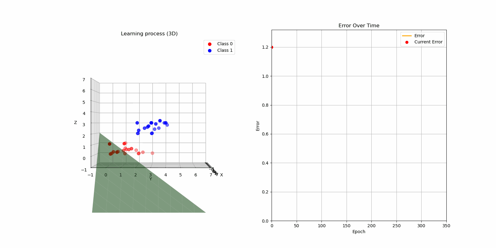

# Perceptron

A simple, generic implementation of a **Perceptron** in Go (Golang), supporting multi-dimensional datasets and optional training history recording.

> **Disclaimer**  
> This project was created **only for educational purposes**.  
> There are **no guarantees** regarding correctness, performance, or suitability for any real-world application.

## Overview

This package implements a basic **linear binary classifier** (perceptron) for numeric datasets.  
It supports:

- Training on **multi-dimensional features**.
  - 2D Example: 
  - 3D Example: 
- **Training history** tracking (optional) — including weights, bias, and mean error after each epoch.

## Features

- Trainable perceptron with a customizable learning rate and epochs.
- Predict new data points after training.
- Access complete **training history** for analysis or visualization.
- Lightweight and dependency-free (except for `golang.org/x/exp/constraints`).

